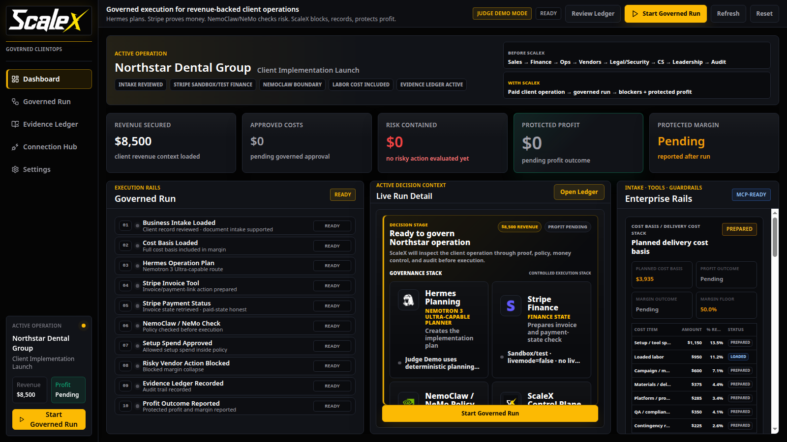
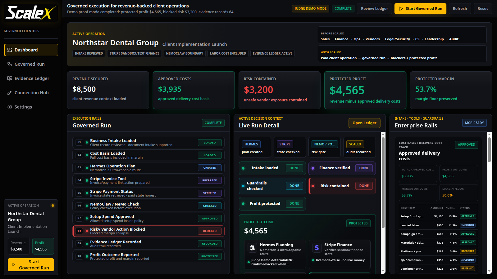
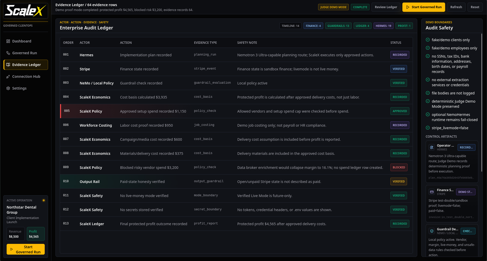
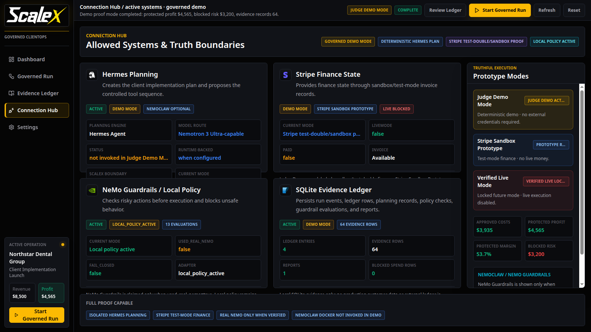

<p align="center">
  
</p>

<h1 align="center">ScaleX</h1>

<p align="center">
  <strong>Governed execution for revenue-backed client operations</strong>
</p>

<p align="center">
  Hermes plans. Nemotron 3 Ultra-capable reasoning supports enterprise planning. Stripe proves
  finance state. NeMo/local policy checks risk. ScaleX blocks unsafe execution and records
  protected profit.
</p>

<p align="center">
  
  
  
  
  
  
  
  
</p>

<p align="center">
  <a href="#quickstart">Quick Start</a> ·
  <a href="#demo-story">Demo Story</a> ·
  <a href="#hackathon-context">Hackathon Context</a> ·
  <a href="#how-it-works">How It Works</a> ·
  <a href="docs/ARCHITECTURE.md">Architecture</a> ·
  <a href="#safety-boundaries">Safety Boundaries</a> ·
  <a href="docs/OPERATOR_GUIDE.md">Operator Guide</a>
</p>

> ScaleX is developed and tested on Linux. Because it uses a Python/FastAPI backend, a Vite
> frontend, and SQLite, it should run on macOS and on Windows through WSL2. Native Windows support
> has not been fully tested yet.

## Hackathon Context

ScaleX was built as a hackathon demo for governed AI execution in revenue-backed client operations.

The demo highlights an enterprise control stack using **Hermes Agent by Nous Research** for
planning, a **NVIDIA Nemotron 3 Ultra-capable reasoning route** for enterprise planning
intelligence, **NVIDIA NeMo / NemoClaw-style policy guardrails** for governed execution checks, and
**Stripe sandbox/test mode** for financial proof. **ScaleX** acts as the control plane for proof,
policy, money control, margin protection, and audit.

<p align="center">
  
  &nbsp;&nbsp;
  
  &nbsp;&nbsp;
  
</p>

<p align="center">
  <em>Technology logos are shown for demo/integration identification only and do not imply endorsement.</em>
</p>



<p align="center">
  <em>Judge Demo Mode pre-run state: revenue is loaded, outcomes are pending, and ScaleX is ready
  to govern the operation.</em>
</p>

## The Big Idea

Most agents can propose actions. Enterprises need governed execution.

ScaleX turns paid client work into a controlled run:

```text
Business intake
-> cost basis
-> Hermes plan / Nemotron 3 Ultra-capable reasoning route
-> Stripe sandbox finance state
-> NeMo/local policy check
-> approved or blocked action
-> evidence ledger
-> protected profit
```

Hermes proposes the work. ScaleX decides what can execute, records proof, blocks unsafe spend, and
reports margin after the real cost basis of the operation.

## Demo Story

The current public demo uses one synthetic client operation:

| Field | Value |
| --- | --- |
| Client | Northstar Dental Group |
| Operation | Client Implementation Launch |
| Revenue secured | $8,500 |
| Approved cost basis after run | $3,935 |
| Risk contained after blocked vendor action | $3,200 |
| Protected profit after run | $4,565 |
| Protected margin | 53.7% |
| Margin floor | 50.0% |

Before the governed run, profit, risk, and margin are pending or zero. After the run, ScaleX reports
the protected outcome and records the proof trail.

## How It Works

| Layer | Role | Boundary |
| --- | --- | --- |
| Business Intake | Loads reviewed operation context | Synthetic/demo data only |
| Hermes Planning | Proposes the implementation plan and supports a Nemotron 3 Ultra-capable reasoning route | Hermes proposes; ScaleX governs |
| Stripe Finance | Provides sandbox/test finance state | No live money |
| NeMo / Local Policy | Checks risky actions before execution | Real NeMo/NemoClaw only when runtime evidence proves it |
| ScaleX Control Plane | Executes allowed actions and blocks unsafe ones | Evidence required |
| SQLite Ledger | Records audit proof | Local runtime DB recreated from schema/seed |

## Screenshots

| Dashboard Ready | Governed Run Complete |
| --- | --- |
|  |  |
| Revenue is loaded; outcomes are pending or zero before execution. | ScaleX records $3,935 approved costs, $3,200 contained risk, $4,565 protected profit, and 53.7% margin. |

| Evidence Ledger | Connection Hub |
| --- | --- |
|  |  |
| Audit rows show actor, action, evidence type, safety note, and status. | Hermes, Stripe, NeMo/local policy, SQLite, execution modes, and truth boundaries are visible. |

## Quickstart

Backend:

```bash
cd backend
python -m venv .venv
source .venv/bin/activate
pip install -r requirements.txt
uvicorn app.main:app --host 127.0.0.1 --port 8790
```

Frontend:

```bash
cd frontend
npm install
VITE_API_BASE_URL=http://127.0.0.1:8790 npm run dev -- --host 127.0.0.1 --port 5174 --strictPort
```

Open:

```text
http://127.0.0.1:5174/
```

You can also use `./scripts/dev.sh` for the local demo workflow. It defaults to backend port
`8790`, frontend port `5174`, and `VITE_API_BASE_URL=http://127.0.0.1:8790`.

The runtime SQLite database `data/scalex.db` is ignored and recreated locally from tracked
`data/schema.sql` and `data/seed.json` when the backend starts or the demo is reset/run.

## Execution Modes

| Mode | Status | Notes |
| --- | --- | --- |
| Judge Demo Mode | Default | Deterministic/local; no credentials required. |
| Stripe Sandbox Prototype | Optional | Test-mode finance path when configured safely; no live money. |
| Verified Live Mode | Locked/future | Not implemented for this hackathon project. |

## Safety Boundaries

- No live money.
- No production customer data.
- Fake/demo clients and employees only.
- No payroll or HR compliance processing.
- No PHI, SSNs, tax IDs, bank data, or real client records.
- No production Hermes claim.
- No real NemoClaw or NeMo runtime claim unless runtime evidence proves it.
- No secrets committed.

## Validation

```bash
./scripts/test.sh
./scripts/check-nemo.sh
cd frontend && npm run build
```

Run the release checks in `docs/OPEN_SOURCE_AUDIT.md` before publishing or pushing a public
release.

## Repository Structure

- `backend/` - FastAPI app, deterministic demo runner, policy/guardrail services, and tests.
- `frontend/` - Vite React control-room UI.
- `docs/` - product, architecture, demo, operator, audit, attribution, decision, and release notes.
- `docs/assets/github/` - small public README screenshots.
- `policies/` - local business-rule policy configuration.
- `scripts/` - local setup, dev, test, reset, and guardrail check helpers.
- `data/` - schema and synthetic seed data only; runtime DB is ignored.
- `demo-assets/` - intentionally public demo placeholders only.

## License And Attribution

This project is licensed under the MIT License. See `LICENSE`.

Third-party names and logos are trademarks of their respective owners. Their use here is for
demo/integration identification only and does not imply endorsement. See `docs/ATTRIBUTIONS.md`.
